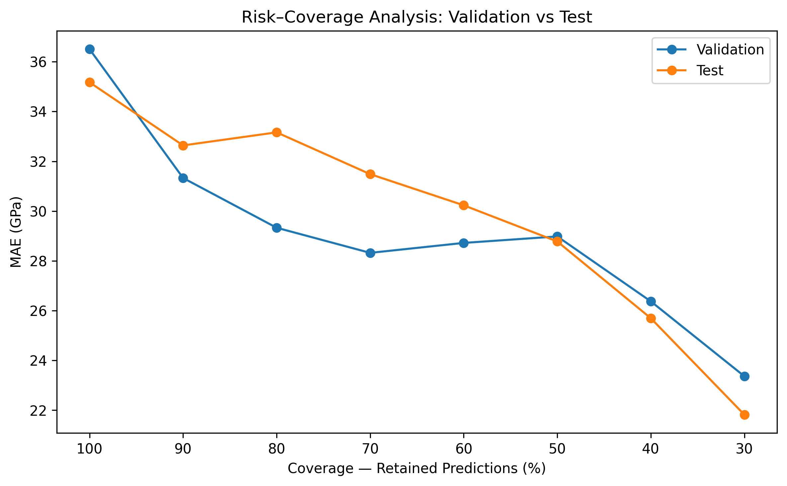
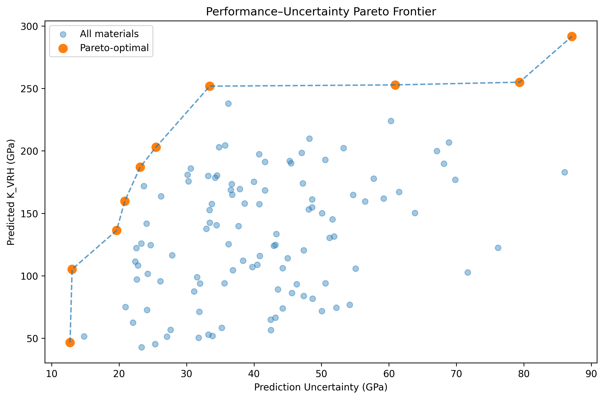

# Uncertainty-Aware Material Selection using Machine Learning

A machine learning framework for predicting material bulk modulus while
explicitly incorporating predictive uncertainty into material selection.

Instead of ranking candidate materials solely by predicted performance, this
project combines property prediction, ensemble-based uncertainty estimation,
risk–coverage analysis, and Pareto optimization to support risk-aware material
screening.

## Project Motivation

Machine learning models used for material property prediction typically return
point estimates. In practical material screening, however, two candidates with
similar predicted properties may have very different levels of model
uncertainty.

This project investigates whether predictive uncertainty can provide useful
information about prediction risk and whether that information can be
incorporated into material selection decisions.

The framework predicts the Voigt-Reuss-Hill bulk modulus (`K_VRH`) and uses
disagreement among individual Random Forest trees as an empirical uncertainty
signal.

## Core Workflow

```text
Material descriptors
        ↓
Bulk modulus prediction
        ↓
Random Forest tree disagreement
        ↓
Empirical uncertainty estimation
        ↓
Uncertainty–error validation
        ↓
Risk–coverage analysis
        ↓
Performance–uncertainty Pareto frontier
        ↓
Decision profiles
        ↓
Material selection support

## Dataset

The project uses an elastic-properties materials dataset containing **1,181
materials** with crystallographic, structural, and elastic-property
information.

The prediction target is:

- **`K_VRH`** — Voigt-Reuss-Hill bulk modulus (GPa), representing resistance
  to uniform compression.

The final baseline feature set contains:

| Feature | Description | Treatment |
|---|---|---|
| `nsites` | Number of atomic sites in the crystal structure | Numerical |
| `volume` | Unit-cell volume | Numerical |
| `space_group` | Crystallographic space-group identifier | Categorical |
| `elastic_anisotropy` | Directional variation in elastic response | Numerical |

Complex structural representations such as full elastic tensors, compliance
tensors, POSCAR data, and structure objects were intentionally excluded from
the baseline framework.

`material_id` and `formula` are retained for reporting and material
identification but are not used as predictive features.

## Data Splitting

A fixed random seed (`random_state=42`) was used to create:

- **80% training set:** 944 materials
- **10% validation set:** 118 materials
- **10% test set:** 119 materials

The test set remained untouched throughout model development, hyperparameter
analysis, uncertainty-method development, and material-selection design. It
was accessed only during final evaluation.

## Exploratory Findings

Several characteristics of the dataset influenced the modeling strategy:

- `nsites` and `volume` are strongly correlated (Pearson r ≈ 0.94).
- `elastic_anisotropy` is highly right-skewed and contains a small number of
  extreme observations.
- These extreme anisotropy observations were retained rather than removed
  automatically because statistical extremeness alone does not establish a
  data error.
- `space_group` was treated as categorical because its numerical value
  represents a crystallographic class rather than a continuous magnitude.

## Modeling Strategy

Several regression baselines were compared using the validation set:

| Model | Validation MAE (GPa) | Validation RMSE (GPa) | Validation R² |
|---|---:|---:|---:|
| Dummy Regressor | 61.54 | 76.34 | -0.005 |
| Linear Regression | 43.93 | 59.17 | 0.397 |
| Ridge Regression | 43.70 | 58.36 | 0.413 |
| Gradient Boosting | 41.11 | 53.49 | 0.507 |
| Random Forest | **36.60** | **50.32** | **0.564** |

Random Forest was selected for further development based on validation
performance and its suitability for ensemble-disagreement uncertainty
analysis.

Cross-validation and complexity analysis were subsequently used to investigate
generalization and overfitting.

The final selected Random Forest configuration was:

```python
RandomForestRegressor(
    n_estimators=300,
    max_depth=16,
    min_samples_split=2,
    min_samples_leaf=1,
    max_features=1.0,
    random_state=42,
    n_jobs=-1
)
```

The selected model achieved a 5-fold cross-validation MAE of approximately
**35 GPa**, consistent with the held-out validation and test performance.

## Predictive Uncertainty

For each material, predictions from all 300 individual Random Forest trees are
collected.

The final property prediction is the mean of the tree predictions:

```text
Prediction = mean(individual tree predictions)
```

Predictive uncertainty is represented by their standard deviation:

```text
Uncertainty = std(individual tree predictions)
```

Higher tree disagreement therefore indicates that the ensemble is less
consistent about a candidate material.

This uncertainty measure is validated empirically by examining:

- correlation between uncertainty and absolute prediction error,
- error across uncertainty groups,
- risk–coverage behavior on validation data,
- independent risk–coverage behavior on the untouched test set.

## Risk–Coverage Analysis

Predictive uncertainty becomes useful only if it provides actionable
information about prediction risk.

Materials were therefore ranked from lowest to highest uncertainty. Increasing
fractions of high-uncertainty predictions were then excluded, and MAE was
recalculated on the retained subset.



On the untouched test set:

| Coverage | Retained Materials | MAE (GPa) |
|---:|---:|---:|
| 100% | 119 | 35.18 |
| 90% | 108 | 32.64 |
| 80% | 96 | 33.16 |
| 70% | 84 | 31.48 |
| 60% | 72 | 30.23 |
| 50% | 60 | 28.78 |
| 40% | 48 | 25.69 |
| 30% | 36 | **21.81** |

The relationship is not perfectly monotonic at every coverage level.
Nevertheless, lower-uncertainty subsets show a clear overall reduction in
prediction error.

At 30% coverage, test MAE is approximately **38% lower** than when predictions
for all test materials are retained.

## Uncertainty-Aware Material Selection

A conventional screening system could simply rank candidate materials by
predicted `K_VRH`.

This project instead treats material selection as a two-objective problem:

- **maximize predicted bulk modulus**
- **minimize predictive uncertainty**

A candidate is considered Pareto-optimal when no other candidate provides
equal or higher predicted performance and equal or lower uncertainty, with at
least one strict improvement.



Using the validation candidate set, **10 of 118 materials** were identified as
Pareto-optimal.

This preserves the trade-off between performance and prediction risk rather
than imposing an arbitrary global ranking immediately.

## Decision Profiles

Three example decision profiles were constructed from the Pareto frontier:

### High Performance

Selects the Pareto candidate with the highest predicted bulk modulus.

- Material: **WC**
- Materials Project ID: `mp-1894`
- Predicted K_VRH: **291.67 GPa**
- Uncertainty: **87.12 GPa**

### Balanced

Balances normalized predicted performance and reliability with equal 50/50
weights.

- Material: **VIr3**
- Materials Project ID: `mp-1082`
- Predicted K_VRH: **251.80 GPa**
- Uncertainty: **33.43 GPa**

The 50/50 weighting represents one decision scenario and is not claimed to be
universally optimal.

### Low Risk

Selects the Pareto candidate with the lowest predictive uncertainty.

- Material: **AlSb**
- Materials Project ID: `mp-2624`
- Predicted K_VRH: **46.65 GPa**
- Uncertainty: **12.73 GPa**

These profiles demonstrate why uncertainty-aware selection can provide more
information than prediction-only ranking. A high predicted property value may
come with substantially greater model disagreement, while a lower-risk
candidate may require accepting lower predicted performance.

## Validation Example

After the three decision profiles had been selected, their known validation
targets were examined for post-selection analysis:

| Profile | Material | Predicted K_VRH | Uncertainty | Actual K_VRH | Absolute Error |
|---|---|---:|---:|---:|---:|
| High Performance | WC | 291.67 | 87.12 | 385.19 | 93.52 |
| Balanced | VIr3 | 251.80 | 33.43 | 319.66 | 67.86 |
| Low Risk | AlSb | 46.65 | 12.73 | 49.20 | 2.55 |

The actual target values were **not used to make these selections**. They were
examined only afterward.

These three examples should not be interpreted as statistical evidence by
themselves. The broader evidence for the uncertainty signal comes from the
full validation and held-out test analyses.

## Repository Structure

```text
Uncertainty-Aware-Material-Selection/
│
├── data/
│   ├── raw/
│   │   └── elastic_tensor.csv
│   └── processed/
│       └── clean_materials_data.csv
│
├── notebooks/
│   ├── 01_data_understanding.ipynb
│   ├── 02_eda.ipynb
│   ├── 03_data_preprocessing.ipynb
│   ├── 04_baseline_modeling.ipynb
│   ├── 05_model_development.ipynb
│   ├── 06_uncertainty_estimation.ipynb
│   ├── 07_material_selection.ipynb
│   └── 08_final_evaluation.ipynb
│
├── src/
│   ├── __init__.py
│   ├── uncertainty.py
│   └── selection.py
│
├── outputs/
│   ├── figures/
│   │   ├── baseline_model_mae.png
│   │   ├── uncertainty_vs_error.png
│   │   ├── risk_coverage_curve.png
│   │   ├── pareto_frontier.png
│   │   └── risk_coverage_validation_test.png
│   │
│   └── models/
│       └── uncertainty_aware_random_forest.joblib
│
├── .gitignore
├── requirements.txt
└── README.md
```

## Installation

Clone the repository and create a virtual environment:

```bash
git clone <repository-url>
cd Uncertainty-Aware-Material-Selection

python -m venv .venv
source .venv/bin/activate
```

Install the required dependencies:

```bash
pip install -r requirements.txt
```

## Reproducibility

The project uses `random_state=42` for data splitting and Random Forest
training.

The notebooks are organized in execution order:

```text
01 → Data Understanding
02 → Exploratory Data Analysis
03 → Data Preprocessing
04 → Baseline Modeling
05 → Model Development
06 → Uncertainty Estimation
07 → Material Selection
08 → Final Evaluation
```

The saved model contains the complete scikit-learn pipeline, including the
categorical preprocessing step and trained Random Forest model.

## Reusable Python Modules

The main uncertainty and selection logic is also available outside the
notebooks.

### Uncertainty estimation

```python
from src.uncertainty import predict_with_uncertainty

prediction, uncertainty, tree_predictions = (
    predict_with_uncertainty(model, X)
)
```

### Pareto selection

```python
from src.selection import (
    identify_pareto_optimal,
    select_decision_profiles
)

candidate_df["pareto_optimal"] = identify_pareto_optimal(
    candidate_df
)

pareto_candidates = candidate_df[
    candidate_df["pareto_optimal"]
].copy()

profiles = select_decision_profiles(
    pareto_candidates
)
```

## Limitations

Several limitations should be considered when interpreting the results.

1. **Dataset size**

   The dataset contains 1,181 materials. Performance and uncertainty behavior
   may change when the framework is applied to substantially larger or more
   diverse materials datasets.

2. **Limited descriptor set**

   The baseline model uses only `nsites`, `volume`, `space_group`, and
   `elastic_anisotropy`. Rich structural information contained in crystal
   structures and elastic tensors is not modeled directly.

3. **Empirical uncertainty**

   Random Forest tree disagreement measures ensemble variability. It is not a
   calibrated predictive interval and does not capture every source of
   uncertainty.

4. **Extreme observations**

   Highly anisotropic materials were retained because statistical extremeness
   alone was not considered sufficient evidence of invalid data. Their
   physical validity was not independently verified in this project.

5. **Material-selection objective**

   The current framework focuses on predicted bulk modulus and prediction
   uncertainty. Real engineering material selection normally involves
   additional objectives and constraints such as density, cost,
   manufacturability, thermal properties, corrosion resistance, and
   application-specific requirements.

6. **Balanced decision profile**

   The balanced profile uses equal normalized weights for performance and
   reliability. This represents an example decision preference rather than a
   universally optimal weighting.

## Future Work

Possible extensions include:

- calibrated prediction intervals,
- conformal prediction,
- quantile regression approaches,
- additional material descriptors,
- composition- and structure-based representations,
- external validation on independent materials datasets,
- multi-property material optimization,
- application-specific engineering constraints,
- active-learning strategies that prioritize high-value uncertain materials.

## Conclusion

This project demonstrates an uncertainty-aware approach to machine-learning
assisted material screening.

Rather than treating property predictions as equally reliable, the framework
uses ensemble disagreement to identify relative prediction risk and combines
this information with predicted material performance through Pareto-based
selection.

On the untouched test set, the final model achieved an MAE of **35.18 GPa**
and an R² of **0.553**. Restricting evaluation to the lowest-uncertainty 30%
of predictions reduced MAE to **21.81 GPa**.

The resulting framework therefore moves beyond point prediction toward
risk-aware decision support for material selection.